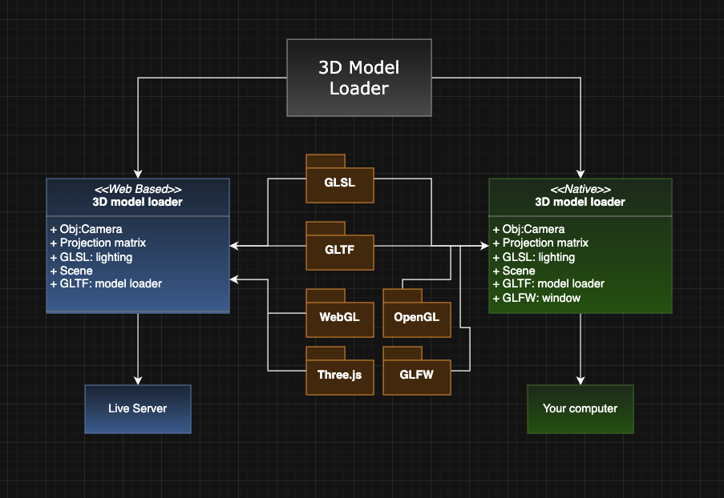
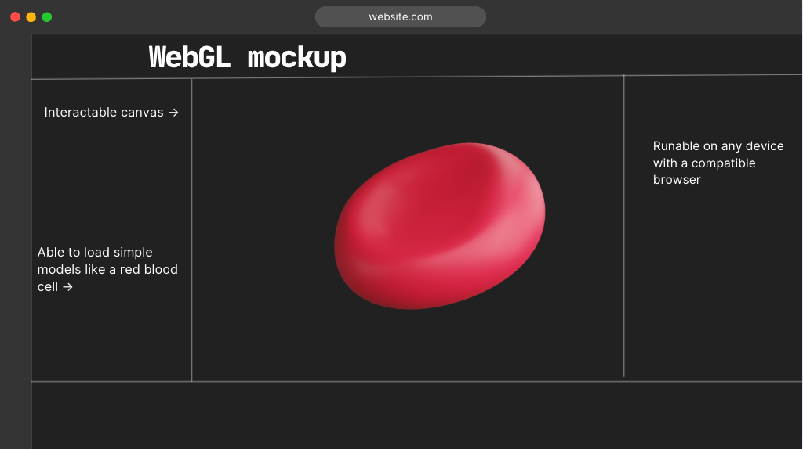

# Individual Project
Individual Repo for IB com sci class - 2026

## 3D Model Loader
UML Diagram

Mockup Program

### Discription:
The purpose of this project is to have some kind of universal model loader. The idea is to have both a native and web based approach where the web based model loder would be able to load more simple models that everyone in the class could interact with. And the native version could be for more complex and demanding tasks that would have more complex lighting for physics.

